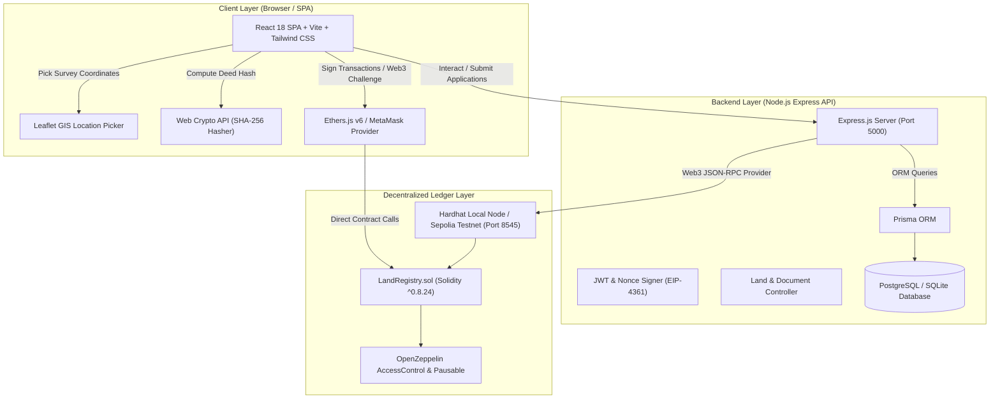

# BHOOMICHAIN — Production-Style Blockchain Land Registration Platform

[](https://nodejs.org/)
[](https://soliditylang.org/)
[](https://hardhat.org/)
[](https://react.dev/)
[](https://www.typescriptlang.org/)
[](https://github.com/harshithkumarhs7/land-registration-blockchain)
[](LICENSE)

A production-grade, tamper-resistant digital cadastre and real estate title conveyance platform leveraging Ethereum-compatible smart contracts, PostgreSQL relational state, and deterministic SHA-256 cryptographic document integrity verification.

---

## 📋 Table of Contents
- [1. System Overview \& Core Value Proposition](#1-system-overview--core-value-proposition)
- [2. System Architecture](#2-system-architecture)
- [3. Key Architectural Innovations](#3-key-architectural-innovations)
- [4. Role-Based Access Control (RBAC) Matrix](#4-role-based-access-control-rbac-matrix)
- [5. Technology Stack](#5-technology-stack)
- [6. Smart Contract Architecture](#6-smart-contract-architecture)
- [7. REST API Reference](#7-rest-api-reference)
- [8. Repository Structure](#8-repository-structure)
- [9. Local Development Quick Start](#9-local-development-quick-start)
- [10. Docker Deployment](#10-docker-deployment)
- [11. Pre-Configured Demo Accounts](#11-pre-configured-demo-accounts)
- [12. Automated Testing Suite](#12-automated-testing-suite)
- [13. Complete 23-Step End-to-End Walkthrough](#13-complete-23-step-end-to-end-walkthrough)
- [14. Security Threat Model \& Safeguards](#14-security-threat-model--safeguards)
- [15. Academic Project Notice \& License](#15-academic-project-notice--license)

---

## 1. System Overview & Core Value Proposition

Traditional land registries in municipal revenue departments suffer from systemic vulnerabilities:
1. **Centralized Data Fragility**: Database tampering or unauthorized administrative overrides can silently alter land ownership records.
2. **Document & Deed Forgery**: Physical deeds and survey sketches can be forged, cloned, or retro-dated without detection.
3. **Double Selling Fraud**: Malicious owners can execute multiple fraudulent sale deeds to different buyers simultaneously.
4. **Opaque Provenance**: Citizens, banks, and legal auditors face opaque bureaucratic processes to verify decades of ownership history.

### How BhoomiChain Solves This:
- **Mathematical Tamper-Resistance**: Land titles are anchored to an Ethereum smart contract. Once registered, ownership state cannot be changed by any database override.
- **Deterministic Cryptographic Document Fingerprinting**: Deed PDFs, revenue receipts, and cadastral maps are hashed via client-side SHA-256. The hash is immutably stored on the blockchain. Altering a single pixel or character invalidates the mathematical proof instantly.
- **Multi-Party Consensus Conveyance**: Property transfers require a 3-way consensus workflow: **Seller Approval $\rightarrow$ Buyer Acceptance $\rightarrow$ Sub-Registrar Execution**.
- **Complete Chain-of-Custody**: Unbroken chronological history of every transfer event (Block #, Timestamp, Previous Owner $\rightarrow$ New Owner, Tx Hash) is publicly verifiable.

---

## 2. System Architecture



---

## 3. Key Architectural Innovations

### A. Client-Side Cryptographic Document Fingerprinting
When a land owner uploads a title deed or revenue receipt, the browser uses the W3C Web Crypto API (`crypto.subtle.digest`) to calculate the SHA-256 checksum **before** uploading.
The SHA-256 digest (`0x...`) is submitted to the backend and recorded on the Ethereum blockchain during sub-registrar approval.

### B. EIP-4361 Web3 Signature Challenge
In addition to standard email/password authentication, BhoomiChain supports wallet-based identity verification:
1. Client requests a 32-byte cryptographically random nonce from `/api/wallet/nonce`.
2. Client signs the nonce via MetaMask using `personal_sign`.
3. Backend recovers the signer's Ethereum address on-chain and issues an authenticated JWT token.

### C. Public Tamper-Evident Inspector
Any citizen or auditor can drag and drop a PDF title deed into the **Public Verification Portal** (`/public/verify`). The portal re-calculates the deed's SHA-256 hash in real time and checks it against the smart contract state:
- ✅ **MATCH**: The document is 100% authentic and unaltered.
- ❌ **MISMATCH**: The document has been modified, tampered with, or forged.

---

## 4. Role-Based Access Control (RBAC) Matrix

| Feature / Action | Citizen / Public | Land Owner | Prospective Buyer | Sub-Registrar | System Admin |
| :--- | :---: | :---: | :---: | :---: | :---: |
| **Search Registered Properties** | ✅ | ✅ | ✅ | ✅ | ✅ |
| **Public Document Integrity Check** | ✅ | ✅ | ✅ | ✅ | ✅ |
| **Submit Land Registration Request** | ❌ | ✅ | ❌ | ❌ | ❌ |
| **Initiate Ownership Transfer** | ❌ | ✅ (Owner) | ❌ | ❌ | ❌ |
| **Accept/Reject Incoming Transfer** | ❌ | ❌ | ✅ (Buyer) | ❌ | ❌ |
| **Approve/Reject Land Application** | ❌ | ❌ | ❌ | ✅ | ❌ |
| **Execute On-Chain Transfer** | ❌ | ❌ | ❌ | ✅ | ❌ |
| **System Dashboard & Telemetry** | ❌ | ❌ | ❌ | ❌ | ✅ |
| **Pause/Unpause Smart Contract** | ❌ | ❌ | ❌ | ❌ | ✅ |
| **View Audit Logs** | ❌ | ❌ | ❌ | ❌ | ✅ |

---

## 5. Technology Stack

### Frontend Architecture
- **Framework**: React 18 + TypeScript + Vite
- **Styling**: Tailwind CSS + Lucide React Icons
- **GIS Mapping**: Leaflet + React-Leaflet (Interactive cadastral pin dropper)
- **Web3 Integration**: Ethers.js v6 + MetaMask Browser Provider
- **State & Charts**: Context API + Recharts (Database telemetry visualization)

### Backend Architecture
- **Runtime**: Node.js v18/v22 + TypeScript
- **Server Framework**: Express.js
- **ORM & Database**: Prisma ORM with SQLite (development) and PostgreSQL 16 (production)
- **Authentication**: Dual JWT + EIP-4361 Web3 Signature Challenge
- **Validation**: Zod runtime schema validation
- **Security**: Helmet headers, CORS policies, Express Rate Limiting, Sanitized Multer File Storage

### Smart Contracts & Blockchain
- **Development Engine**: Hardhat (Solidity `^0.8.24`)
- **Base Libraries**: OpenZeppelin Contracts v5 (`AccessControl`, `ReentrancyGuard`, `Pausable`)
- **Target Networks**: Hardhat Local Node (`http://127.0.0.1:8545`, Chain ID `31337`), Sepolia Testnet

---

## 6. Smart Contract Architecture

The core contract [`LandRegistry.sol`](file:///c:/Users/harsh/.gemini/antigravity/scratch/land-registration-blockchain/blockchain/contracts/LandRegistry.sol) inherits from OpenZeppelin `AccessControl`, `Pausable`, and `ReentrancyGuard`.

```solidity
// Core State Structures
struct LandParcel {
    string propertyId;
    string surveyNumber;
    uint256 areaSqFt;
    string propertyType;
    string locationDetails;
    address currentOwner;
    bytes32 documentHash;
    uint256 registrationTimestamp;
    bool isRegistered;
    bool isTransferPending;
}

struct OwnershipHistory {
    address previousOwner;
    address newOwner;
    uint256 transferTimestamp;
    uint256 blockNumber;
    bytes32 transactionHash;
}
```

### Key Smart Contract Functions
- `registerLand(propertyId, surveyNumber, areaSqFt, propertyType, locationDetails, ownerAddress, documentHash)`: Executable by `REGISTRAR_ROLE`.
- `transferOwnership(propertyId, newOwnerAddress)`: Executable by `REGISTRAR_ROLE` upon verified mutual consent.
- `verifyDocumentHash(propertyId, inputDocumentHash)`: Returns `bool` comparing input document hash against stored state.
- `getOwnershipHistory(propertyId)`: Returns full chronological ownership provenance array.
- `pause()` / `unpause()`: Emergency controls executable by `DEFAULT_ADMIN_ROLE`.

---

## 7. REST API Reference

| Method | Endpoint | Access Level | Description |
| :--- | :--- | :--- | :--- |
| `POST` | `/api/auth/register` | Public | Register new user account |
| `POST` | `/api/auth/login` | Public | Authenticate user and return JWT |
| `GET` | `/api/auth/me` | Authenticated | Get current logged-in user profile |
| `POST` | `/api/wallet/nonce` | Public | Generate EIP-4361 signing nonce |
| `GET` | `/api/public/lands` | Public | Search public registered properties |
| `GET` | `/api/public/verify/:id` | Public | Retrieve property blockchain verification |
| `POST` | `/api/registrations` | Land Owner | Submit new land registration request |
| `GET` | `/api/registrations/my` | Land Owner | View submitted registration applications |
| `POST` | `/api/registrations/:id/approve` | Registrar | Approve registration & record on-chain |
| `POST` | `/api/transfers/initiate` | Land Owner | Initiate property ownership transfer |
| `POST` | `/api/transfers/:id/respond` | Buyer | Accept or reject transfer request |
| `POST` | `/api/transfers/:id/execute` | Registrar | Approve & execute transfer on smart contract |
| `GET` | `/api/admin/dashboard` | Admin | Fetch system analytics & telemetry |
| `GET` | `/api/admin/audit-logs` | Admin | Fetch audit trail log entries |

---

## 8. Repository Structure

```
land-registration-blockchain/
├── blockchain/                 # Hardhat smart contract development environment
│   ├── contracts/              # LandRegistry.sol
│   ├── scripts/                # deploy.ts (deployment & initial seed script)
│   ├── test/                   # Comprehensive Hardhat test suite (15 tests)
│   └── hardhat.config.ts
├── backend/                    # Express REST API orchestration layer
│   ├── prisma/                 # schema.prisma, schema.postgres.prisma, seed.ts
│   ├── src/                    # Controllers, Services, Middlewares, Routes, Blockchain
│   └── tests/                  # Automated integration test suite (12 tests)
├── frontend/                   # React Vite single page application
│   ├── src/
│   │   ├── components/         # Navbar, Sidebar, MapLocationPicker, PropertyCard, Modals
│   │   ├── pages/              # Public, Owner, Buyer, Registrar, and Admin pages
│   │   └── context/            # AuthContext, Web3Context
│   └── index.html
├── docs/                       # Architectural & Academic Documentation
│   ├── diagrams/               # Mermaid sequence, ER, and architecture diagrams
│   ├── architecture.md
│   ├── database.md
│   ├── blockchain.md
│   ├── api.md
│   ├── security.md
│   ├── testing.md
│   └── user-flows.md
├── docker/                     # Dockerfiles for backend, frontend, and blockchain
├── docker-compose.yml          # Full multi-container composition
├── package.json                # Workspace orchestration scripts
├── .env.example
└── SECURITY.md                 # Security threat model & disclosure policy
```

---

## 9. Local Development Quick Start

### Prerequisites
- **Node.js**: `v18+` or `v22+`
- **npm**: `v9+`
- **MetaMask Browser Extension**: (Optional; demo buttons are built into `/login`)

### Step 1: Install Dependencies
From the repository root:
```bash
npm run blockchain:install
npm run backend:install
npm run frontend:install
```

### Step 2: Initialize & Seed Database
```bash
npm run backend:migrate
npm run backend:seed
```

### Step 3: Start Services

**Terminal 1 — Local Ethereum Blockchain Node:**
```bash
npm run blockchain
```
*Listens on `http://127.0.0.1:8545` (Chain ID `31337`)*

**Terminal 2 — Deploy Smart Contract:**
```bash
npm run deploy:contract
```

**Terminal 3 — Express Backend API:**
```bash
npm run backend
```
*Runs on `http://localhost:5000` (Health check: `http://localhost:5000/health`)*

**Terminal 4 — React Frontend Application:**
```bash
npm run frontend
```
*Runs on `http://localhost:5173`*

---

## 10. Docker Deployment

Launch the entire stack with a single command:
```bash
docker compose up --build
```
This starts:
- `postgres`: PostgreSQL 16 on port 5432
- `blockchain`: Hardhat node on port 8545
- `backend`: Express API on port 5000
- `frontend`: React SPA served via Nginx on port 80

---

## 11. Pre-Configured Demo Accounts

The Login page (`http://localhost:5173/login`) features **1-click quick login buttons** for all pre-seeded roles:

| Role | Email | Password | Hardhat Wallet Address |
| :--- | :--- | :--- | :--- |
| **System Admin** | `admin@landregistry.gov` | `Admin@123456` | `0xf39Fd6e51aad88F6F4ce6aB8827279cffFb92266` |
| **Sub-Registrar** | `registrar@landregistry.gov` | `Registrar@123456` | `0x70997970C51812dc3A010C7d01b50e0d17dc79C8` |
| **Land Owner** | `owner@gmail.com` | `Owner@123456` | `0x3C44CdDdB6a900fa2b585dd299e03d12FA4293BC` |
| **Buyer** | `buyer@gmail.com` | `Buyer@123456` | `0x90F79bf6EB2c4f870365E785982E1f101E93b906` |

---

## 12. Automated Testing Suite

The repository includes a comprehensive automated test suite (27 total tests).

### Run Smart Contract Tests (15 Tests)
```bash
npm run test:contract
```
*Tests access control roles, duplicate property prevention, zero-address validation, multi-party transfer execution, document hash verification, and emergency pausability.*

### Run Backend Integration Tests (12 Tests)
```bash
npm run test:backend
```
*Tests authentication, JWT issuance, RBAC enforcement, wallet nonce generation, public verification, and administrative metrics via Vitest.*

### Run Full Test Suite
```bash
npm run test:all
```

---

## 13. Complete 23-Step End-to-End Walkthrough

1. Navigate to `http://localhost:5173/login`.
2. Click **Land Owner** quick-login (`owner@gmail.com`).
3. View the Owner Dashboard and initial pre-seeded property `PROP-KA-BLR-001`.
4. Click **Register Land** in navigation.
5. Fill out Survey Number (`204/1A`), Area (`1800 sq ft`), Type (`Residential`), Village (`Indiranagar`), District (`Bengaluru Urban`).
6. Pinpoint coordinates on the interactive **Leaflet Map**.
7. Upload a sample title deed PDF — observe client-side **SHA-256 fingerprinting**.
8. Submit application.
9. Log out and log in as **Sub-Registrar** (`registrar@landregistry.gov`).
10. Open **Land Applications**.
11. Inspect document integrity using the **Cryptographic Integrity Inspector**.
12. Click **Approve On-Chain**: watch the contract transaction submit and mine on Hardhat!
13. Log in as **Prospective Buyer** (`buyer@gmail.com`).
14. Navigate to **Browse Properties** to inspect registered parcels.
15. Log in as **Land Owner** and navigate to **Ownership Transfers**.
16. Initiate a transfer to the buyer (`buyer@gmail.com`).
17. Log in as **Buyer** to accept the transfer request.
18. Log in as **Sub-Registrar** and navigate to **Transfer Approvals**.
19. Click **Approve & Transfer**: smart contract reassigns ownership on Ethereum.
20. Log in as **Buyer**: observe property is now in your active portfolio.
21. Open **Public Verification** (`/public/verify`).
22. Enter Property ID `PROP-KA-BLR-001`.
23. Observe complete blockchain proof: owner address, block number, tx hash, and ownership provenance chain.

---

## 14. Security Threat Model & Safeguards

| Threat Vector | Severity | Safeguard Implementation |
| :--- | :---: | :--- |
| **Unauthorized DB Overrides** | CRITICAL | Blockchain state serves as authoritative source-of-truth. DB mismatches are flagged immediately. |
| **Deed Document Forgery** | HIGH | Client-side SHA-256 hash stored on-chain. Any single-bit file modification invalidates verification. |
| **Double Selling** | HIGH | Smart contract checks `isTransferPending` and enforces single active transfer workflow per parcel. |
| **Re-entrancy Attacks** | HIGH | All state-changing smart contract methods implement OpenZeppelin `ReentrancyGuard` (`nonReentrant`). |
| **Privilege Escalation** | MEDIUM | Strict Express RBAC middleware + OpenZeppelin `AccessControl` (`REGISTRAR_ROLE`, `DEFAULT_ADMIN_ROLE`). |
| **Replay Attacks** | MEDIUM | Wallet authentication uses single-use EIP-4361 cryptographically random nonces. |

---

## 15. Academic Project Notice & License

This project is an advanced academic engineering prototype demonstrating decentralized ledger technology in municipal public administration.

**License**: Distributed under the [MIT License](LICENSE).
