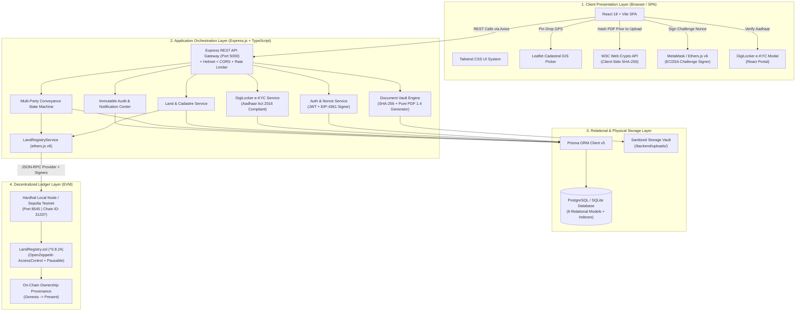
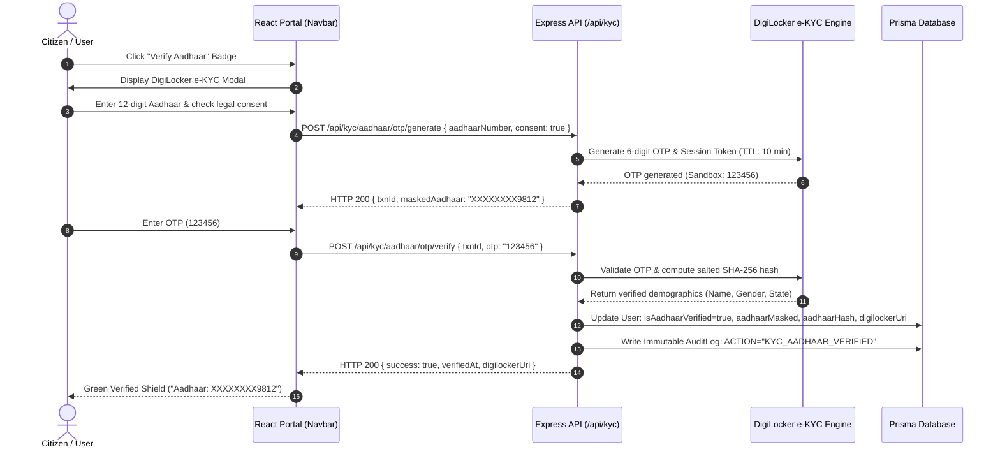
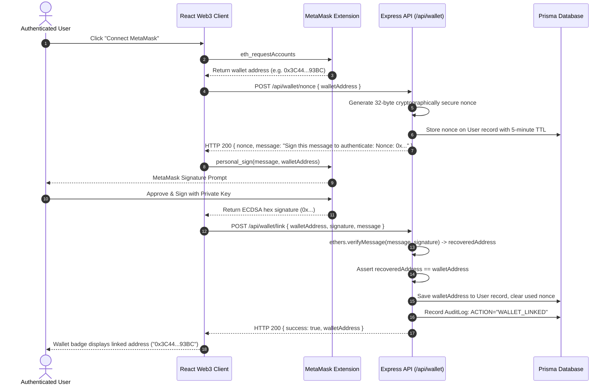
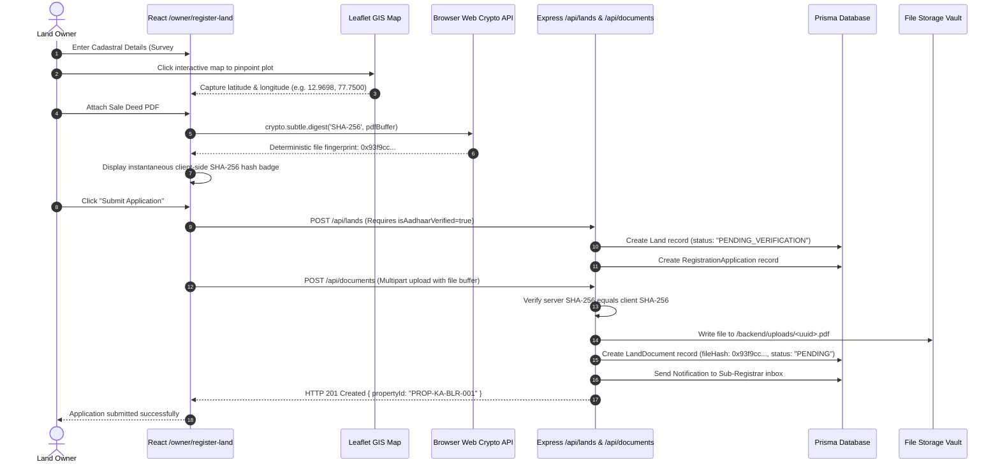
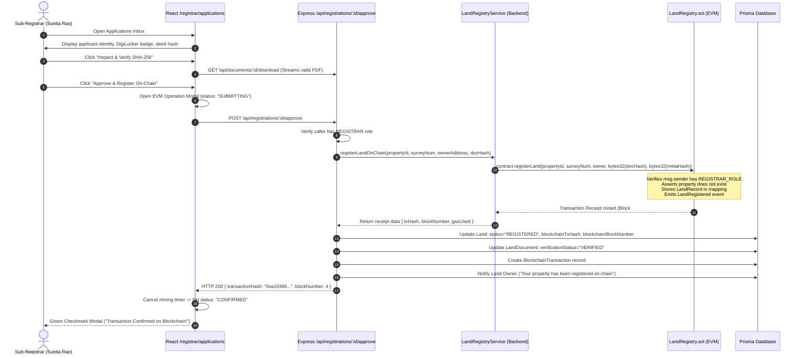
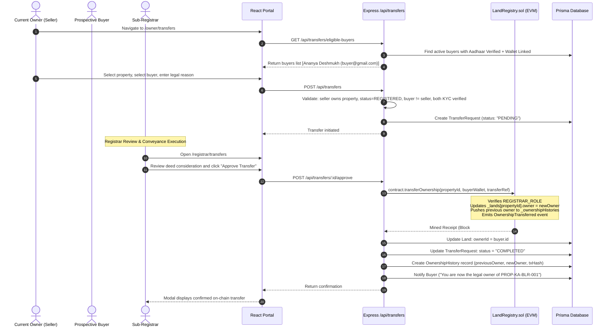
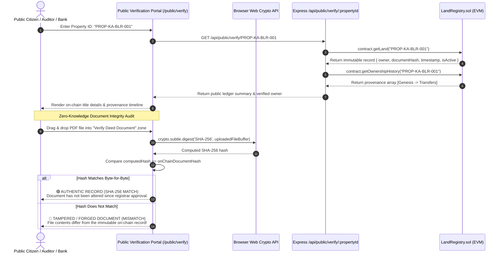

# BhoomiChain — Complete Technical Architecture, Tech Stack & End-to-End Workflows

## 1. Executive Summary & System Architecture

**BhoomiChain** is an enterprise-grade, decentralized land records management and real estate title conveyance platform. It integrates **Ethereum smart contracts**, **DigiLocker Aadhaar e-KYC**, **client-side SHA-256 cryptographic document verification**, a **Prisma-managed relational database**, and a **React 18 GIS cadastre frontend**.

### Architectural Topology Diagram



---

## 2. Complete Technology Stack by Purpose & Layer

### A. Presentation Layer (Frontend)

| Technology | Version | Purpose & Responsibilities | Architectural Rationale & Implementation Details |
| :--- | :--- | :--- | :--- |
| **React** | `^18.3.1` | Core User Interface Library | Component-driven Single Page Application (SPA). Uses state hooks (`useState`, `useEffect`), contextual providers (`AuthContext`, `Web3Context`), and React Portals for modal isolation. |
| **Vite** | `^5.4.21` | Build Tool & Local Dev Server | High-performance bundling via Rollup/esbuild, sub-second Hot Module Replacement (HMR), and internal reverse-proxy mapping `/api` to the backend on `:5000`. |
| **TypeScript** | `^5.6.2` | Static Typing & Type Safety | Eliminates runtime bugs across data models (`Land`, `LandDocument`, `TransferRequest`, `User`, `BlockchainTransaction`). |
| **Tailwind CSS** | `^3.4.11` | Utility-First Styling System | Design system optimized for institutional portals. Provides a deep slate/navy color palette, dynamic status badges, and responsive tables. |
| **Leaflet & React-Leaflet** | `^1.9.4` / `^4.2.1` | Interactive Cadastral GIS | Allows land owners to pinpoint parcels via GPS coordinates (`latitude`, `longitude`) with interactive marker placement on OpenStreetMap. |
| **Lucide React** | `^0.441.0` | Vector Iconography | Clean, consistent icons (`ShieldCheck`, `Cpu`, `Wallet`, `FileCheck2`, `ArrowLeftRight`) across all role-based views. |
| **Recharts** | `^2.12.7` | Administrative Data Telemetry | Interactive charts on administrative and registrar dashboards, visualizing land area distributions, registration timelines, and system metrics. |
| **Axios** | `^1.7.7` | Promise-Based HTTP Client | Centralized API client with automatic JWT authorization header injection and unified error interceptors. |
| **W3C Web Crypto API** | Native Browser | Client-Side Pre-Upload Hashing | `crypto.subtle.digest('SHA-256', buffer)` computes the cryptographic fingerprint of title deeds directly inside the citizen's browser before upload. |
| **Ethers.js (Browser Provider)** | `^6.13.2` | Web3 Wallet Bridge | Interfaces with `window.ethereum` (MetaMask) to execute `personal_sign` for cryptographic challenge-response authentication. |

---

### B. Application Orchestration Layer (Backend API)

| Technology | Version | Purpose & Responsibilities | Architectural Rationale & Implementation Details |
| :--- | :--- | :--- | :--- |
| **Node.js** | `v20.x` / `v22.x` | Runtime Environment | High-throughput asynchronous event-driven runtime handling concurrent blockchain JSON-RPC calls, file uploads, and database queries. |
| **Express.js** | `^4.21.0` | REST API Server Framework | Structured MVC architecture with dedicated routers, controllers, and services for authentication, KYC, land, documents, transfers, and blockchain operations. |
| **TypeScript & TSX** | `^5.6.2` / `^4.19.1` | Native ESM Execution | Fully typed backend codebase executed directly via `tsx watch src/server.ts` with zero transpilation latency. |
| **Zod** | `^3.23.8` | Runtime Schema Validation | Validates request payloads (registration, transfer initiation, login, document status) to reject malformed inputs before reaching service layers. |
| **JSON Web Token (JWT)** | `^9.0.2` | Stateless Authentication | Issues signed HMAC SHA-256 tokens carrying claims (`userId`, `email`, `role`) with an 8-hour expiration. |
| **Bcrypt.js** | `^2.4.3` | Password Hashing | 10 rounds of cryptographic salting and hashing (`bcrypt.genSalt(10)`) preventing rainbow table and dictionary attacks. |
| **Helmet** | `^7.1.0` | HTTP Header Hardening | Enforces secure HTTP response headers (`Content-Security-Policy`, `X-Content-Type-Options`, `X-Frame-Options`). |
| **Express-Rate-Limit** | `^7.4.0` | DoS & Brute-Force Defense | Rate-limits public search and authentication endpoints to mitigate automated credential stuffing and denial-of-service attempts. |
| **Multer** | `^1.4.5-lts.1` | Multipart Form-Data Handling | Ingests document uploads into memory buffers (`multer.memoryStorage()`) so the backend can verify and hash them before writing to disk. |
| **PDF 1.4 Generator** | Native Node.js | Standards-Compliant PDF Engine | Zero-dependency, pure Node.js generator producing valid PDF 1.4 documents with cross-reference tables (`xref`), font descriptors, and official stamps for demo deeds and missing file recovery. |

---

### C. Relational & Persistence Layer

| Technology | Version | Purpose & Responsibilities | Architectural Rationale & Implementation Details |
| :--- | :--- | :--- | :--- |
| **Prisma ORM** | `^5.19.1` | Object-Relational Mapping | Schema-first database abstraction supporting migrations, relational queries, atomic transactions (`prisma.$transaction`), and seeding. |
| **SQLite (Dev) / PostgreSQL 16 (Prod)** | Native / `16-alpine` | Relational Storage | SQLite provides zero-configuration local development; PostgreSQL provides ACID-compliant production deployment with foreign keys and cascading deletions. |

---

### D. Decentralized Blockchain & Smart Contract Layer

| Technology | Version | Purpose & Responsibilities | Architectural Rationale & Implementation Details |
| :--- | :--- | :--- | :--- |
| **Solidity** | `^0.8.24` | Smart Contract Programming | EVM-native smart contract language with built-in arithmetic overflow/underflow checks. |
| **Hardhat** | `^2.22.10` | EVM Local Blockchain & Tooling | Runs the local testnet node (`http://127.0.0.1:8545`, Chain ID `31337`), manages compilation, deploys contracts, and exports artifacts. |
| **OpenZeppelin Contracts** | `^5.0.2` | Smart Contract Security Primitives | Standard libraries including `AccessControl` for granular roles (`REGISTRAR_ROLE`, `DEFAULT_ADMIN_ROLE`), `Pausable` for circuit breakers, and `ReentrancyGuard`. |
| **Ethers.js (Backend)** | `^6.13.2` | EVM Bridge & Signer Management | Manages `JsonRpcProvider`, connects admin and registrar private keys, formats `bytes32` hashes, calls contract functions, and waits for block confirmation receipts. |

---

### E. Identity, Security & Regulatory Compliance Layer

| Component / Standard | Purpose & Responsibilities | Architectural Rationale & Implementation Details |
| :--- | :--- | :--- |
| **DigiLocker & Aadhaar e-KYC** | Citizen Identity Verification | **Aadhaar Act 2016 Compliant**: Never persists raw 12-digit numbers. Stores masked references (`XXXXXXXX9812`), official DigiLocker URNs (`in.gov.uidai-adhr-...`), and salted SHA-256 hashes (`num + salt`) for deduplication. |
| **EIP-4361 Challenge-Response** | MetaMask Signature Verification | Generates 32-byte cryptographically secure random nonces with a 5-minute TTL. Verifies ECDSA signatures using `ethers.verifyMessage` to bind wallets to user accounts. |
| **SHA-256 Document Integrity Engine** | Tamper-Evident Title Deeds | Deterministic hashing of PDF deeds and survey sketches into 32-byte digests stored immutably on-chain for zero-knowledge mathematical verification. |

---

## 3. End-to-End System & User Workflows

### Flow 1: Citizen Identity & DigiLocker Aadhaar e-KYC



1. **Consent & Input**: The citizen enters their 12-digit Aadhaar number and accepts the statutory consent agreement under the Aadhaar Act 2016.
2. **OTP Generation**: The backend triggers an OTP request through the DigiLocker sandbox gateway, returning an encrypted transaction ID (`txnId`) and a masked display string (`XXXXXXXX9812`).
3. **Verification & Hashing**: When the OTP is confirmed, the backend computes a salted SHA-256 hash of the Aadhaar number to prevent duplicate registrations across different accounts.
4. **Credential Storage**: The citizen's profile is updated with `isAadhaarVerified: true`, `aadhaarMasked`, and the official DigiLocker document URN (`in.gov.uidai-adhr-XXXXXXXX9812`).

---

### Flow 2: Web3 Challenge & MetaMask Wallet Linking (EIP-4361)



1. **Nonce Generation**: The client requests a challenge from `/api/wallet/nonce`. The server generates a random 32-byte hex nonce with a 5-minute time-to-live (TTL).
2. **Cryptographic Signing**: MetaMask prompts the user to sign the standard EIP-4361 challenge string using their private key (`personal_sign`).
3. **Address Recovery**: The backend uses `ethers.verifyMessage` to recover the signer's public address and verifies it matches the submitted address.
4. **Account Binding**: The verified wallet address is linked to the user's profile and the single-use nonce is invalidated.

---

### Flow 3: Cadastral Land Registration & Document Hashing



1. **Cadastral Pinpoint**: The owner enters official survey details and clicks on the Leaflet map to establish geographic boundaries (`latitude`, `longitude`).
2. **Client-Side Hashing**: The browser computes the document's SHA-256 fingerprint via `crypto.subtle.digest` before the file is transmitted.
3. **Ingestion & Storage**: The backend validates that the applicant is DigiLocker-verified, stores the parcel in `PENDING_VERIFICATION` status, writes the document to the sanitized storage vault, and notifies the registrar.

---

### Flow 4: Sub-Registrar Verification & Blockchain Anchoring



1. **Title Review**: The Sub-Registrar reviews the deed and verifies that the client's computed SHA-256 hash matches official revenue records.
2. **Smart Contract Invocation**: The registrar initiates an on-chain registration. The backend signs the transaction using the authorized registrar private key and invokes `LandRegistry.registerLand(...)`.
3. **Ledger Immutability**: The smart contract records the property ID, survey number, owner wallet address, and document hash in contract storage and emits a `LandRegistered` event.
4. **State Transition**: The local database updates the parcel status to `REGISTERED` with the confirmed block number and transaction hash.

---

### Flow 5: Multi-Party Title Conveyance (Ownership Transfer)



1. **Buyer Nomination**: The seller selects a verified prospective buyer from `/api/transfers/eligible-buyers`. Both parties must have verified Aadhaar e-KYC and linked Web3 wallets.
2. **Conveyance Request**: The seller submits the transfer request with a conveyance reason, setting the request to `PENDING`.
3. **Registrar Execution**: The Sub-Registrar executes `LandRegistry.transferOwnership(...)`.
4. **On-Chain Mutation**: The contract updates the active owner to the buyer's wallet address, appends the previous owner to the historical provenance array, and records the transfer transaction reference.

---

### Flow 6: Public Zero-Knowledge Document Tamper Detection



1. **Ledger Query**: Any citizen can query a property ID without logging in. The system reads directly from the smart contract to retrieve the registered owner, document hash, and transfer history.
2. **Zero-Knowledge File Verification**: The user drops a local deed PDF into the browser. The browser calculates the SHA-256 hash locally and compares it with the on-chain hash.
3. **Tamper Proof**: If even a single character or byte in the document was altered, the computed hash will not match the immutable on-chain hash, immediately detecting forgery.

---

## 4. Relational Database Schema & Data Models

The relational schema consists of **9 models** configured in `backend/prisma/schema.prisma`:

| Model Name | Primary Keys & Indexes | Key Fields & Types | Relational Purpose & Cascade Policies |
| :--- | :--- | :--- | :--- |
| **`User`** | PK: `id` (UUID)<br/>Unique: `email`, `walletAddress`, `aadhaarHash` | `name`, `email`, `passwordHash`, `role`, `walletAddress`, `isAadhaarVerified`, `aadhaarMasked`, `digilockerUri`, `nonce` | Central identity entity for citizens, owners, buyers, sub-registrars, and admins. Stores salted Aadhaar hashes and Web3 challenge nonces. |
| **`Land`** | PK: `id` (UUID)<br/>Unique: `propertyId`<br/>Index: `surveyNumber`, `district`, `status` | `propertyId`, `surveyNumber`, `area`, `landType`, `village`, `district`, `latitude`, `longitude`, `status`, `blockchainTxHash` | Represents the cadastral parcel. Tracks geographic coordinates, municipal metadata, and blockchain transaction references. |
| **`LandDocument`** | PK: `id` (UUID)<br/>Index: `landId`, `fileHash` | `landId`, `uploadedById`, `documentType`, `originalFileName`, `storagePath`, `fileHash` (SHA-256), `verificationStatus` | Stores metadata and cryptographic hashes for deeds, survey maps, and tax receipts. Cascades delete on parent `Land`. |
| **`RegistrationApplication`** | PK: `id` (UUID)<br/>Index: `applicantId`, `landId`, `status` | `applicantId`, `landId`, `status`, `remarks`, `reviewedById`, `reviewedAt` | Government administrative workflow for registering new land parcels. Tracks review timestamps and registrar remarks. |
| **`TransferRequest`** | PK: `id` (UUID)<br/>Index: `landId`, `sellerId`, `buyerId`, `status` | `landId`, `sellerId`, `buyerId`, `status`, `reason`, `blockchainTxHash`, `reviewedById` | Multi-party title conveyance state machine tracking seller initiation, buyer nomination, and registrar execution. |
| **`OwnershipHistory`** | PK: `id` (UUID)<br/>Index: `landId`, `previousOwnerId`, `newOwnerId` | `landId`, `previousOwnerId`, `newOwnerId`, `transferRequestId`, `blockchainTxHash`, `transferredAt` | Chronological title provenance log replicating the smart contract's internal history for fast indexed search. |
| **`BlockchainTransaction`**| PK: `id` (UUID)<br/>Unique: `transactionHash`<br/>Index: `landId`, `status` | `landId`, `transactionHash`, `blockNumber`, `transactionType`, `fromAddress`, `toAddress`, `gasUsed`, `status` | Direct mirror of EVM transaction receipts for telemetry, gas analysis, and auditability. |
| **`AuditLog`** | PK: `id` (UUID)<br/>Index: `userId`, `action`, `entityType`, `createdAt` | `userId`, `action`, `entityType`, `entityId`, `ipAddress`, `userAgent`, `metadata` (JSON) | Immutable record of system actions (`USER_LOGIN`, `DOCUMENT_UPLOADED`, `LAND_REGISTERED_BLOCKCHAIN`). |
| **`Notification`** | PK: `id` (UUID)<br/>Index: `userId`, `isRead` | `userId`, `title`, `message`, `type`, `isRead`, `createdAt` | In-app notification center alerting users to application approvals, transfer requests, and verification status changes. |

---

## 5. Security Architecture & Cryptographic Safeguards

```
+--------------------------------------------------------------------------------------------------+
|                                    DEFENSE-IN-DEPTH MATRIX                                       |
+------------------------------------+-------------------------------------------------------------+
| Attack Vector / Security Concern   | Implemented Architectural Safeguard                         |
+------------------------------------+-------------------------------------------------------------+
| Unauthorized Ownership Mutation    | Smart contract functions enforce REGISTRAR_ROLE via         |
|                                    | OpenZeppelin AccessControl. Direct database edits do not    |
|                                    | affect on-chain ownership proofs.                           |
+------------------------------------+-------------------------------------------------------------+
| Aadhaar Data Leakage (Aadhaar Act) | Zero raw 12-digit Aadhaar persistence. Only masked numbers  |
|                                    | (XXXXXXXX9812) and deterministic salted SHA-256 hashes are  |
|                                    | stored for deduplication.                                   |
+------------------------------------+-------------------------------------------------------------+
| Replay & Signature Spoofing        | EIP-4361 Web3 challenges use cryptographically random       |
|                                    | 32-byte nonces with a 5-minute TTL, invalidated upon use.   |
+------------------------------------+-------------------------------------------------------------+
| Reentrancy in Smart Contracts      | Contract state-changing methods inherit OpenZeppelin's      |
|                                    | ReentrancyGuard (nonReentrant modifier).                    |
+------------------------------------+-------------------------------------------------------------+
| Emergency Freezes & Audits         | LandRegistry inherits Pausable. Admins can trigger pause()  |
|                                    | to immediately halt all transfers and registrations.        |
+------------------------------------+-------------------------------------------------------------+
| Timing Attacks                     | Hash comparison uses crypto.timingSafeEqual to prevent      |
|                                    | side-channel timing analysis.                               |
+------------------------------------+-------------------------------------------------------------+
| Double Selling / Conflicting Deeds | Active transfer state machine rejects overlapping requests  |
|                                    | for the same property ID.                                   |
+------------------------------------+-------------------------------------------------------------+
| Missing File / 500 Download Errors | Storage vault features self-healing PDF 1.4 generation,      |
|                                    | dynamically synthesizing valid PDF archives if physical     |
|                                    | files are missing from disk.                                |
+------------------------------------+-------------------------------------------------------------+
```
